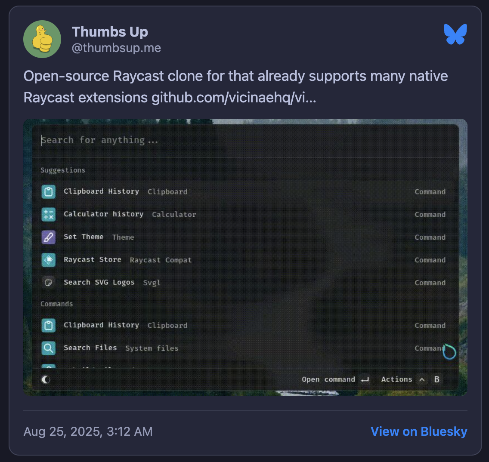
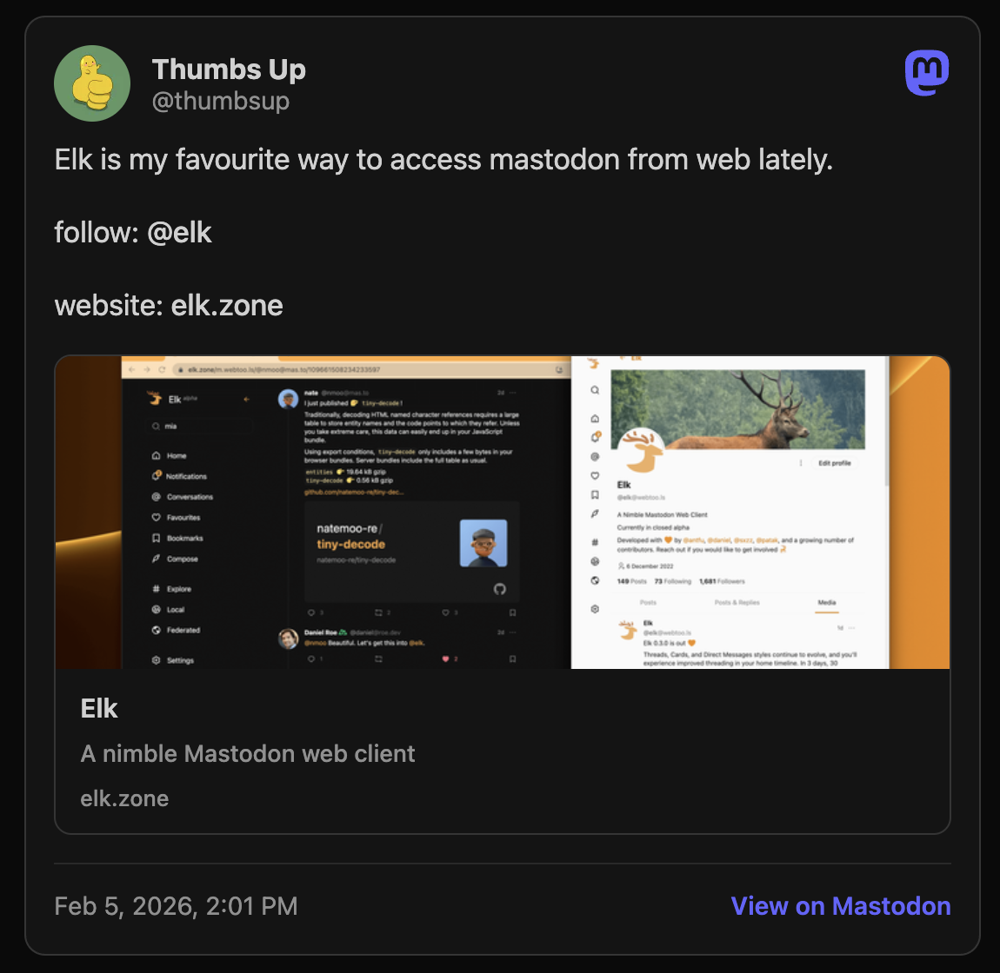
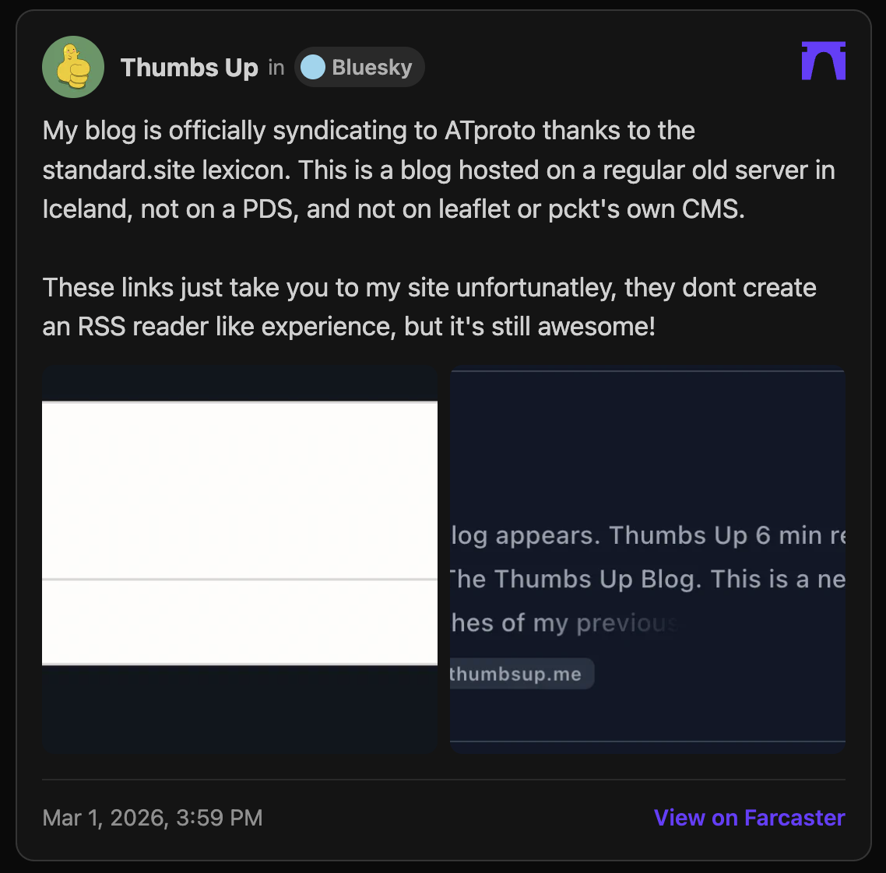

# Social Embed Cards

Hugo shortcodes for embedding social posts from **Bluesky**, **Mastodon**, and **Farcaster** — rendered at build time as static HTML.

<!-- Screenshots: replace these with actual images before publishing -->
<!--



-->

Because the API calls happen during `hugo build` (not in the visitor's browser), your visitors never make requests to Bluesky, Mastodon, or Neynar servers. Avatars, post images, and link preview thumbnails are downloaded at build time and served from your own domain — visitors never contact platform CDNs either. The page loads with fully static HTML.

No tracking scripts, cookies, analytics, or JavaScript required.

---

## Requirements

- Hugo v0.110.0+ extended
- A Neynar API key ([neynar.com](https://neynar.com)) if using the Farcaster card

---

## Installation

1. Copy the shortcode files into your Hugo site's `layouts/shortcodes/`:

   ```
   layouts/shortcodes/bluesky-card.html
   layouts/shortcodes/mastodon-card.html
   layouts/shortcodes/farcaster-card.html
   ```

2. Copy the timestamp partial into `layouts/partials/`:

   ```
   layouts/partials/social-cards-timestamp.html
   ```

3. Include the partial once in your site's `<head>` or before `</body>`. For example, in a partial you already include:

   ```html
   {{ partial "social-cards-timestamp.html" . }}
   ```

   This converts timestamps from UTC to the visitor's local time. If you skip it, timestamps will display in UTC instead.

4. Define CSS variables in your theme (see [Theming](#theming) below).

---

## Usage

In any post or page:

```markdown





```

---

## API Keys

| Platform  | Key required? | Notes |
|-----------|--------------|-------|
| Bluesky   | No | Uses the public Bluesky API |
| Mastodon  | No | Uses the public instance API — works with any Mastodon-compatible server |
| Farcaster | Yes | Set `NEYNAR_API_KEY` as an environment variable at build time |

For Farcaster, set the key wherever you run `hugo build`. For example in GitHub Actions:

```yaml
- name: Build
  env:
    NEYNAR_API_KEY: ${{ secrets.NEYNAR_API_KEY }}
  run: hugo --minify
```

The key is read at build time only. It never appears in rendered HTML.

If `NEYNAR_API_KEY` is not set, the Farcaster shortcode falls back to a plain link.

---

## Theming

The shortcodes use CSS variables for all colours and fonts. Add these to your stylesheet and set values to match your theme:

```css
:root {
  --sc-bg:              #f5f5f7;  /* Card background */
  --sc-bg-hover:        #e8e8ec;  /* Pill / hover background */
  --sc-text:            #1d1d1f;  /* Primary text */
  --sc-text-secondary:  #3a3a3c;  /* Secondary text */
  --sc-text-muted:      #86868b;  /* Handles, timestamps */
  --sc-border:          #d2d2d7;  /* Card border */
  --sc-divider:         #c6c6cb;  /* Footer divider, channel pill */
  --sc-font:            system-ui, sans-serif;
}
```

For dark mode, override inside your dark selector:

```css
[data-color-scheme="dark"] {
  --sc-bg:             #1c1c1e;
  --sc-bg-hover:       #2c2c2e;
  --sc-text:           #f5f5f7;
  --sc-text-secondary: #d1d1d6;
  --sc-text-muted:     #86868b;
  --sc-border:         #38383a;
  --sc-divider:        #48484a;
}
```

---

## Privacy

- API calls happen at **build time** — your visitors never contact Bluesky, Mastodon, or Neynar
- Avatars, post images, and link preview thumbnails are fetched at build time via `resources.GetRemote` and served from your own domain — visitors never contact platform CDNs
- Images are converted to WebP and avatars resized to 2× their display size for retina screens
- No JavaScript is required for the cards themselves
- No cookies, localStorage, analytics, or tracking scripts
- Farcaster API key is a server-side env var and never appears in output HTML

---

## Other Static Site Generators

These shortcodes are Hugo-specific and use Hugo's `resources.GetRemote` for build-time API fetching. They cannot be used directly in Astro, Eleventy, Jekyll, or other SSGs. However, the same pattern is achievable in:

- **Astro** — use `fetch()` in a `.astro` component's frontmatter
- **Eleventy** — use the [`eleventy-fetch`](https://www.11ty.dev/docs/plugins/fetch/) plugin
- **Next.js** — use `getStaticProps` or server components

Contributions for other SSGs are welcome.

---

## Files

```
social-cards/
├── hugo/
│   ├── shortcodes/
│   │   ├── bluesky-card.html
│   │   ├── mastodon-card.html
│   │   └── farcaster-card.html
│   └── social-cards-timestamp.html
├── README.md
└── LICENSE
```

---

## License

MIT
